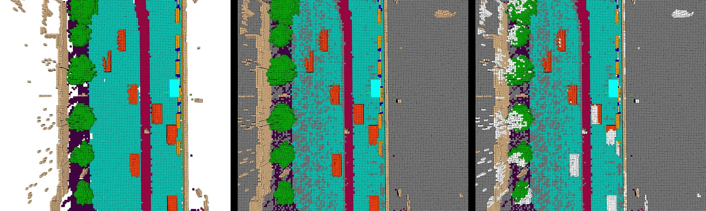

<div id="top" align="center">

# Occ3D: A Large-Scale 3D Occupancy Prediction Benchmark for Autonomous Driving


<a href="#devkit">
  
</a>
<a href="#license">
  
</a>

<!--  -->

</div>

## Table of Contents
  - [Introduction](#introduction)
  - [Data](#data)
    - [Basic Information](#basic-information)
    - [Occ3D-Waymo](#occ3d-waymo)
    - [Occ3D-nuScenes](#occ3d-nuScenes)
  - [Getting Started](#getting-started)
  - [License](#license)


## Introduction


## Data

### Basic Information
- <strong>How are the labels annotated?</strong> The ground truth labels of occupancy derive from accumulative LiDAR scans with human annotations. 
  - If a voxel reflects a LiDAR point, then it is assigned as the same semantic label as the LiDAR point;
  - If a LiDAR beam passes through a voxel in the air, the voxel is set to be `free`;
  - Otherwise, we set the voxel to be unknown, or unobserved. This happens due to the sparsity of the LiDAR or the voxel is occluded, e.g. by a wall. In the dataset, `[mask_lidar]` is a 0-1 binary mask, where `0` represent unobserved voxels. As shown in Fig.1(b), grey voxels are unobserved. Due to the limitation of the visualization tool, we only show unobserved voxels at the same height as the ground. 

- <strong>Camera visibility.</strong> Note that the installation positions of LiDAR and cameras are different, therefore, some observed voxels in the  LiDAR view are not seen by the cameras. Since we focus on a vision-centric task, we provide a binary voxel mask `[mask_camera]`, indicating whether the voxels are observed or not in the current camera view. As shown in Fig.1(c), white voxels are observed in the accumulative LiDAR view but unobserved in the current camera view.

- Both `[mask_lidar]` and `[mask_camera]` masks are optional for training. Only `[mask_camera]` is used for evaluation; the unobserved voxels are not involved during calculating the mIoU. Since Waymo only has 5 cameras and does not provide a 360-degree surround view, we additionally provide `[mask_fov]`. 

- We generate two 3D occupancy prediction datasets, Occ3D-Waymo and Occ3D-nuScenes. The detailed descriptions of each dataset are as follows.

<div id="top"  align="center">

</div>
<div id="top" align="center">
Figure 1. Semantic labels (left), visibility masks in the LiDAR (middle) and the camera (right) view. Grey voxels are unobserved in LiDAR view and white voxels are observed in the accumulative LiDAR view but unobserved in the current camera view.
</div>

### Occ3D-Waymo
<div align="center">
  
| Type |  Info |
| :----: | :----: |
| train           | 798 |
| val             | 202 |
| test            | 150 |
| cameras         | 5 |
| voxel size      | [0.1m, 0.1m, 0.2m] / [0.4m, 0.4m, 0.4m] |
| range           | [-80m, -80m, -5m, 80m, 80m, 7.8m] / [-40m, -40m, -1m, 40m, 40m, 5.4m] |
| volume size     | [1600, 1600, 64] / [200, 200, 16]|
| classes        | 0 - 15 |
</div>

- The dataset contains 15 classes. The definition of classes from 0 to 14 is `TYPE_GENERALOBJECT, TYPE_VEHICLE, TYPE_PEDESTRIAN, TYPE_SIGN, TYPE_CYCLIST, TYPE_TRAFFIC_LIGHT, TYPE_POLE, TYPE_CONSTRUCTION_CONE, TYPE_BICYCLE, TYPE_MOTORCYCLE, TYPE_BUILDING, TYPE_VEGETATION, TYPE_TREE_TRUNK, TYPE_ROAD, TYPE_WALKABLE`.The label 15 category represents voxels that are not occupied by anything, which is named as `free`. Voxel semantics for each sample frame is given as `[semantics]` in the labels.npz. Please note that there is a slight difference between the Occ classes and the classes used in the [Waymo LiDAR segmentation](https://github.com/waymo-research/waymo-open-dataset/blob/bae19fa0a36664da18b691349955b95b29402713/waymo_open_dataset/protos/segmentation.proto#L20).

- After download and unzip files, the hierarchy of folder `Occ3D-Waymo/` is described below:
  ```
  └── Occpancy3D-Waymo
      |
      ├── training
      |   ├── 000
      |   |   ├── 000.npz
      |   |   ├── 000_04.npz
      |   |   ├── 001.npz
      |   |   ├── 001_04.npz
      |   |   ├── 002.npz
      |   |   ├── 002_04.npz
      |   |   └── ...
      |   |     
      |   ├── 001
      |   |   ├── 000.npz
      |   |   ├── 000_04.npz
      |   |   └── ...
      |   ├── ...
      |   |
      |   └── 797
      |       ├── 000.npz
      |       ├── 000_04.npz
      |       └── ...
      |
      ├── validation
      |   ├── 000
      |   |   └── ...
      |   ├── ...
      |   |
      |   └── 201
      |       ├── 000.npz
      |       ├── 000_04.npz
      |       └── ...
      |
      └── test
          └── ...

  ```

  - `training/validation/test` contains data for each scene, each scene includes corresponding ground truth of each frame.
  - `*.npz` contains `[voxel_label]`, `[origin_voxel_state]`, `[final_voxel_state]` , and `[infov]` for each frame. We provide two types of voxel size data, with voxel size of 0.1m and 0.4m, respectively. `*_04.npz` represents the data with a voxel size of 0.4m.
    ```
    import numpy as np
    data = np.load("010/105.npz")
    semantics, mask_lidar, mask_camera, mask_fov = data['voxel_label'], data['origin_voxel_state'], data['final_voxel_state'], data['infov']
    print(semantics.shape)
    print(np.unique(semantics))
    ```

<p align="right">(<a href="#top">back to top</a>)</p>


### Occ3D-nuScenes
<div align="center">
  
| Type |  Info |
| :----: | :----: |
| train           | 600 |
| val             | 150 |
| test            | 250 |
| cameras         | 6 |
| voxel size      | [0.1m, 0.1m, 0.2m] / [0.4m, 0.4m, 0.4m] |
| range           | [-80m, -80m, -5m, 80m, 80m, 7.8m] / [-40m, -40m, -1m, 40m, 40m, 5.4m] |
| volume size     | [1600, 1600, 64] / [200, 200, 16]|
| classes        | 0 - 17 |
</div>

- The dataset contains 18 classes. The definition of classes from 0 to 16 is the same as the [nuScenes-lidarseg](https://github.com/nutonomy/nuscenes-devkit/blob/fcc41628d41060b3c1a86928751e5a571d2fc2fa/python-sdk/nuscenes/eval/lidarseg/README.md) dataset. The label 17 category represents `free`. Voxel semantics for each sample frame is given as `[semantics]` in the labels.npz. 

- The hierarchy of folder `Occpancy3D-nuScenes-V1.0/` is described below:
  ```
  └── Occpancy3D-nuScenes-V1.0
      |
      ├── mini
      |
      ├── trainval
      |   ├── imgs
      |   |   ├── CAM_BACK
      |   |   |   ├── n015-2018-07-18-11-07-57+0800__CAM_BACK__1531883530437525.jpg
      |   |   |   └── ...
      |   |   ├── CAM_BACK_LEFT
      |   |   |   ├── n015-2018-07-18-11-07-57+0800__CAM_BACK_LEFT__1531883530447423.jpg
      |   |   |   └── ...
      |   |   └── ...
      |   |     
      |   ├── gts  
      |   |   ├── [scene_name]
      |   |   |   ├── [frame_token]
      |   |   |   |   └── labels.npz
      |   |   |   └── ...
      |   |   └── ...
      |   |
      |   └── annotations.json
      |
      └── test
          ├── imgs
          └── annotations.json

  ```
  - `imgs/` contains images captured by various cameras.
  - `gts/` contains the ground truth of each sample. `[scene_name]` specifies a sequence of frames, and `[frame_token]` specifies a single frame in a sequence.
  - `annotations.json` contains meta infos of the dataset.
  - `labels.npz` contains `[semantics]`, `[mask_lidar]`, and `[mask_camera]` for each frame. 

  ```
  annotations {
      "train_split": ["scene-0001", ...],                         <list> -- training dataset split by scene_name
      "val_split": list ["scene-0003", ...],                      <list> -- validation dataset split by scene_name
      "scene_infos" {                                             <dict> -- meta infos of the scenes    
          [scene_name]: {                                         <str> -- name of the scene.  
              [frame_token]: {                                    <str> -- samples in a scene, ordered by time
                      "timestamp":                                <str> -- timestamp (or token), unique by sample
                      "camera_sensor": {                          <dict> -- meta infos of the camera sensor
                          [cam_token]: {                          <str> -- token of the camera
                              "img_path":                         <str> -- corresponding image file path, *.jpg
                              "intrinsic":                        <float> [3, 3] -- intrinsic camera calibration
                              "extrinsic":{                       <dict> -- extrinsic parameters of the camera
                                  "translation":                  <float> [3] -- coordinate system origin in meters
                                  "rotation":                     <float> [4] -- coordinate system orientation as quaternion
                              }   
                              "ego_pose": {                       <dict> -- vehicle pose of the camera
                                  "translation":                  <float> [3] -- coordinate system origin in meters
                                  "rotation":                     <float> [4] -- coordinate system orientation as quaternion
                              }                
                          },
                          ...
                      },
                      "ego_pose": {                               <dict> -- vehicle pose
                          "translation":                          <float> [3] -- coordinate system origin in meters
                          "rotation":                             <float> [4] -- coordinate system orientation as quaternion
                      },
                      "gt_path":                                  <str> -- corresponding 3D voxel gt path, *.npz
                      "next":                                     <str> -- frame_token of the previous keyframe in the scene 
                      "prev":                                     <str> -- frame_token of the next keyframe in the scene
                  }
              ]             
          }
      }
  }
  ```

<p align="right">(<a href="#top">back to top</a>)</p>


## Getting Started
soon.


## License
Before using the dataset, you should register on the website and agree to the terms of use of the [nuScenes](https://www.nuscenes.org/nuscenes) and [Waymo](https://waymo.com/open/).
The code used to generate the data and the generated data are both subject to the [MIT License](./LICENSE).

<p align="right">(<a href="#top">back to top</a>)</p>
